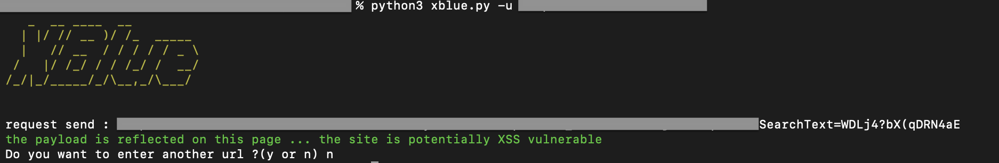
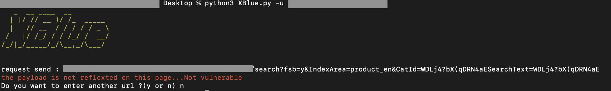

# XBLUE

XBlue is a simple XSS program open source , that inject a payload to see if it's reflected and potentially vulnerable. It's written in python


## Screenshots

-------------------

 Examples :

  1. Found vulnerabilities 



  2. Not Found vulnerabilities 




## Installation

-------------------

1. `git clone https://github.com/hug016/XBLUE.git`
2. `cd xblue`
3. `pip3 install -r requirements.txt`

## Usage

-------------------

Basic use :

```bash
python3 XBlue.py <url>
```

## Options

-------------------

`-h` or `--help`  : Display help informations and options.

#### General options :

`-u ` or `--url`: Specified the url website.


#### Thank's. The project is under development
